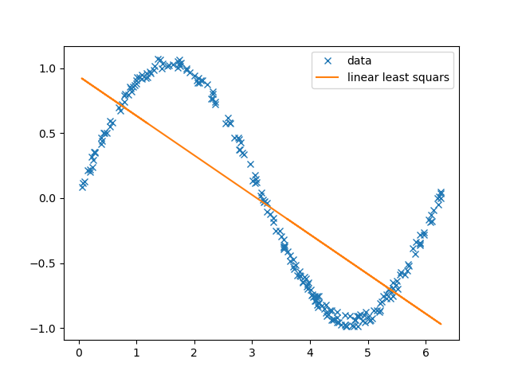

# A detour into fit quality and preprocessing

We have implemented the simplest of prediction tools at this point, and now it's time to talk about some data practices that are commonplace. 
I mentioned in another module that it's common practice to split your data into training and testing to tune your model. In what follows, 
we will actually do this, with some data that I have cooked up for visualizability and which can be found in `cooked.csv`.

The setup is basically as follows: there is some relationship between input and output, and we want to ascertain that relationship approximately. 
In reality, I have taken 300 random numbers uniformally sampled from the interval $$ [0,2 \pi]$$ and I constructed the ''output'' field by using code along the lines of 
`
input = np.random.rand(300)
output = np.sin(300) + np.random.rand(300) * 0.1
`
and we are trying to see how close we can get to this relation. 
I have added some noise to make things a little more interesting. 

## Partitioning data

I have given you a single set of data with only a ''training'' set. In the real world, you harvest data from some source and then use it to 
build some model, but it's necessary to somehow validate that your data actually makes good predictions. You would prefer not to do this in a 
production setting because it's unnecessarily risky. 

I like splitting my data into 20 percent testing and 80 percent training. There are holy wars fought about how much of your data should be training
and how much should be testing; I am no great authority on this subject but people care about it. This is pretty simple to do, for what it's worth. 
All that you  need to do is import data from the included `.csv` file and split it such that some fraction of the data won't be used to train the model that you're working with. 

## Underfitting 

For now, it's fine to use the least squares implementation from whatever library you like. I'll use `numpy.linalg.lstsq()` for mine. Partition your data into training and testing, and then use least squares regression on the training data. Plot the least squares fit on top of the training data. 
You should get something like this: 

You can tell from looking at the plot that there are clearly features of the data which are not captured by the linear fit that we've used to describe it. This is called underfitting, and it is empirically characterized by a ''large'' variance between the training data and the fit produced. There are tests which can be used to diagnose underfitting, but it's usually clear when underfitting is a problem. We also might guess that we have underfit our data by looking at the loss function between the fit and the training data. It will be relatively large, i.e. extensive in the number of points and the average value of the training data.

One way to solve this problem is to use a more sophistocated model. We can turn least squares into something more powerful by ''adding'' data. From our previous work, we know that least squares fits a vector $\beta$ so that the $y \approx \beta_1 x_1 + \beta_2 x_d \dots + \beta_0$. Linear funcitons like this are only so general; what we need is to modify the least squares algorithm so that more phenomena can be easily approximated. Recall that polynomials are universal approximants, so that any function $f(x_1) = a_0 + x_1 a_1 + x_1^2 a_2 + \dots $. Evidently, we just need higher order terms. Thankfully, it's straight forward to add these to the model. 

In the data that I have included, there is only a single column of inputs, namely, x value, but apparently the relationship between input and output depends on the input in a nonlinear way. 
In the last step, we appended ones to the data in order to manipulate the least squares algorithm into a more useful form. Note that for any number $x$, $x^0 = 1$. So $$\hat{x} = \langle x, x^0 = 1\rangle$$ is our ''preprocessed data''. To solve this underfitting, we will just add more powers of $x$ into our preprocessed data so that $$\hat{x} = \langle x^n, x^{n-1}, \dots ,x, x^0\rangle$$. 

Then, the least squares algorithm will give us a $beta$ vector such that 
$y \approx \beta_n x^n + \beta_{n-1} x_{n-1} + \dots + \beta_1 x_1 + \beta_0$ which is more powerful than what we've previously done.  

